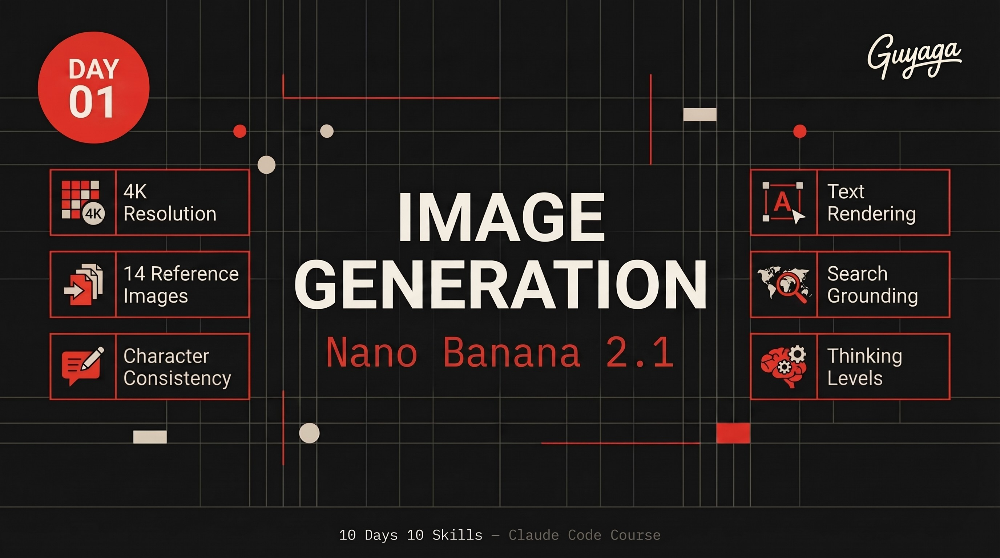

<p align="center">
  
</p>

<h1 align="center">Day 01 — Image Generation</h1>
<p align="center">
  <strong>10 Days 10 Skills</strong> · Claude Code Course by <a href="https://bestguy.ai">Guy Aga</a>
</p>
<p align="center">
  
  
  
</p>

---

## What is This?

This skill lets you **generate and edit professional images** directly from Claude Code using Google's **Nano Banana 2.1** model (`gemini-nano-banana-2.1`). No Photoshop, no design tools, no design skills needed — just describe what you want in words.

### What Can You Create?

- **Social media graphics** — Instagram posts, stories, LinkedIn banners
- **Infographics** — Educational visuals with accurate, readable text
- **Product mockups** — Professional marketing assets
- **Brand materials** — Logos, covers, presentations
- **Data visualizations** — Charts and graphs from real-time data
- **Photo editing** — Edit existing photos with text prompts

### Why Nano Banana 2.1?

| Feature | What It Means for You |
|---------|----------------------|
| **4K Resolution** | Print-quality images, not blurry thumbnails |
| **Text Rendering** | Readable text on images, including Hebrew |
| **14 Reference Images** | Send your logo, photos, examples — the AI follows them |
| **Character Consistency** | Keep the same person across scenes, a storybook or a whole campaign |
| **Multi-Turn Editing** | Generate an image, then say "make the background blue" — it remembers |
| **Google Search Grounding** | Create visuals based on real-time data (weather, stocks, trends) |
| **Thinking Levels** | Minimal for fast drafts, high for text-heavy designs |
| **Ultra-Wide Formats** | 4:1 and 8:1 banners and website heroes, seamless |

### New in October 2026: Nano Banana 2.1 replaces Nano Banana Pro

We tested both models on 34 identical prompts: Hebrew ads, menus, infographics, long text, fonts, text placement, character consistency and tricky edge cases. **Nano Banana 2.1 won 16, Pro won 3, and 15 were ties.** It also costs about 2.5× less (~$0.05 vs $0.134 per 2K image). The skill now uses 2.1 by default and keeps Pro available for layouts that must be followed very literally.

**Already installed the skill?** Paste this into Claude Code:

```
Update my nano-banano-pro skill: cd into ~/.claude/skills/nano-banano-pro and run git pull. If it isn't a git folder, replace its SKILL.md with the latest one from https://github.com/guyaga/10d10s-day01-image-generation. Then confirm the skill now uses gemini-nano-banana-2.1.
```

---

## Prerequisites

Before you start, make sure you have:

- [ ] **Claude Code** installed (Pro or Max subscription)
- [ ] **Node.js 20+** installed on your computer
- [ ] A **Google AI Studio** account
- [ ] A **Gemini API Key** (pay-as-you-go — ~$0.05 per 2K image)

---

## Step 1: Get Your API Key

1. Go to [Google AI Studio](https://aistudio.google.com/apikey)
2. Click **"Create API Key"**
3. Select or create a Google Cloud project
4. Copy your API key

> **Important:** Gemini API uses pay-as-you-go pricing. Set up a [Google Cloud billing profile](https://console.cloud.google.com/billing). Each 2K image costs about $0.05 ($0.113 for 4K, 50% off with batch mode). Start with **$5-10 in credits** — that's well over 100 images.

---

## Step 2: Set Up Your Environment

### Option A: Environment Variable (Recommended)

```bash
# Windows (PowerShell)
$env:GEMINI_API_KEY="your-api-key-here"

# Windows (Command Prompt)
set GEMINI_API_KEY=your-api-key-here

# macOS / Linux
export GEMINI_API_KEY=your-api-key-here
```

### Option B: .env File

Create a `.env` file in your project folder:

```
GEMINI_API_KEY=your-api-key-here
```

---

## Step 3: Install the Skill

### In Claude Code:

The skill is already installed if you're following the course. If not:

```bash
# Navigate to your skills folder
cd ~/.claude/skills/

# Clone this skill
git clone https://github.com/guyaga/10d10s-day01-image-generation nano-banano-pro
```

### Install the SDK:

```bash
npm install @google/genai
```

---

## Step 4: Your First Image

The simplest way — just ask Claude Code:

```
Generate a professional social media post about AI tools 
using Swiss design style with red and black colors
```

Claude Code will use the skill automatically and generate the image for you.

### Behind the Scenes

Here's what the skill does (you don't need to write this code — Claude does it for you):

```javascript
import { GoogleGenAI } from "@google/genai";

const ai = new GoogleGenAI({ apiKey: process.env.GEMINI_API_KEY });

const response = await ai.models.generateContent({
  model: 'gemini-nano-banana-2.1',
  contents: 'Your prompt here',
  config: {
    responseModalities: ['TEXT', 'IMAGE'],
    imageConfig: {
      aspectRatio: '16:9',  // 1:1, 4:5, 3:4, 16:9, 9:16, 21:9, 4:1, 8:1 ...
      imageSize: '2K',      // 1K, 2K, 4K
    },
    thinkingConfig: { thinkingLevel: 'MEDIUM' },  // MINIMAL (fast) / MEDIUM / HIGH (text-heavy)
  },
});
```

---

## Step 5: Using Reference Images

This is where it gets powerful. You can send your own images as references:

```
Generate a branded social media post using my logo from logo.png 
and my photo from me.jpg in Swiss design style
```

The skill supports **up to 14 reference images**:
- Up to 10 object images (logos, products, brand assets)
- Up to 4 people kept consistent (photos of people for consistency)

**Tip for consistent characters:** start from a portrait on a plain white background, and in every prompt list what must stay the same ("keep her face, curly hair, round glasses and yellow jacket identical").

---

## Step 6: Multi-Turn Editing

Generate an image, then refine it with follow-up requests:

```
1. "Create a course cover image with bold typography"
2. "Make the title bigger and add a red accent line"
3. "Change the background to pure black"
4. "Add my logo in the top left corner"
```

Each edit builds on the previous result — like having a conversation with a designer.

---

## Configuration Options

| Option | Values | What It Does |
|--------|--------|-------------|
| `imageSize` | `1K`, `2K`, `4K` | Output resolution (always use 2K minimum) |
| `aspectRatio` | `1:1`, `4:5`, `3:4`, `4:3`, `16:9`, `9:16`, `21:9`, `4:1`, `8:1` and more | Image dimensions |
| `tools` | `[{googleSearch: {}}]` | Enables real-time data in images |
| `thinkingConfig` | `MINIMAL`, `MEDIUM`, `HIGH` | Speed vs care. `MINIMAL` ≈ 15 s, `HIGH` for lots of text |

### Common Aspect Ratios

| Use Case | Ratio |
|----------|-------|
| Instagram Post | `1:1` or `4:3` |
| Instagram Story | `9:16` |
| YouTube Thumbnail | `16:9` |
| LinkedIn Banner | `16:9` |
| Presentation Slide | `16:9` |
| Website Hero Banner | `4:1` or `8:1` |

---

## Tips for Better Results

1. **Be specific** — "A Swiss-design social media post with bold red typography on black background" beats "make me a cool image"
2. **Mention colors by hex** — "Use #E63B2E for accents" gives precise results
3. **Describe layout** — "Logo top-left, title center, photo on right side"
4. **Reference styles** — "Like a high-end tech conference banner"
5. **Always use 2K** — Never use 1K, the quality difference is huge
6. **Hebrew text** — Put every text in quotes and ask for it "spelled exactly as given, right-to-left". Proofread anything over about 30 words
7. **Fonts** — Describe the look ("tall condensed bold", "classic book serif") rather than relying only on a font name

---

## Troubleshooting

| Problem | Solution |
|---------|----------|
| "API key not found" | Make sure `GEMINI_API_KEY` is set in your environment or `.env` file |
| Blurry output | Change `imageSize` from `'1K'` to `'2K'` |
| Text not readable | Add "text must be perfectly legible" to your prompt |
| Typo in Hebrew text | Regenerate with `thinkingLevel: 'HIGH'`, or shorten the text |
| Wrong colors | Specify exact hex codes in the prompt |
| Generation fails | Check your API quota at [Google AI Studio](https://aistudio.google.com/) |

---

## Links

- [Google AI Studio — Get API Key](https://aistudio.google.com/apikey)
- [Gemini API Pricing](https://ai.google.dev/gemini-api/docs/pricing)
- [Course Page — bestguy.ai](https://bestguy.ai/course/10-days-10-skills)
- [HTML Skill Guide (Hebrew)](https://bestguy.ai/course/guides/day01-image-generation.html)

---

<p align="center">
  <strong>10 Days 10 Skills</strong> — Claude Code Course<br>
  <a href="https://bestguy.ai">bestguy.ai</a> · Guy Aga &copy; 2026
</p>
